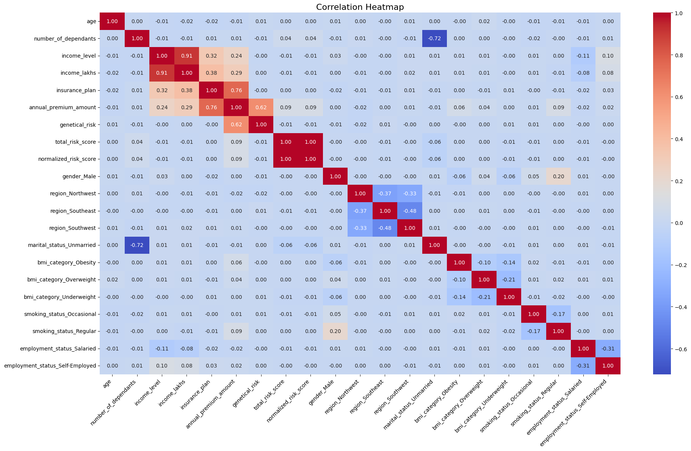
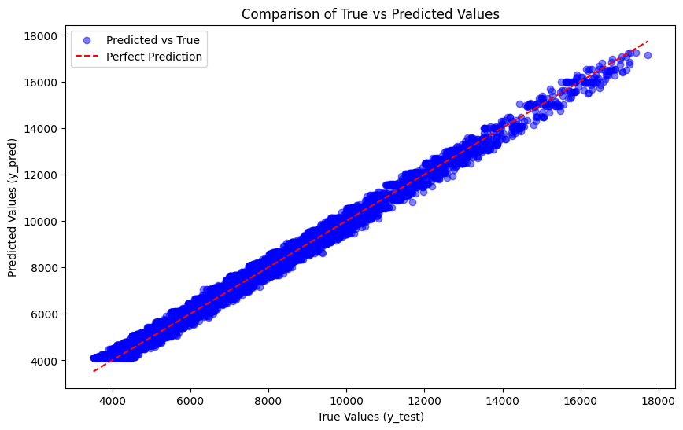

# 🏥 ML Insurance Premium Estimator 💰

[](https://www.python.org/downloads/)
[](https://streamlit.io/)
[](https://scikit-learn.org/)
[](https://xgboost.readthedocs.io/)

## 📋 Project Overview

This machine learning application predicts health insurance premiums based on personal and health-related factors. The project uses regression models to estimate annual premium amounts based on features such as age, gender, BMI, smoking status, medical history, and more.

Url: https://insurance-price-estimator-by-kasimajji.streamlit.app

## 🔍 Features

- 🧮 **Premium Prediction**: Estimates insurance premiums using ML models
- 🎯 **Age-Specific Models**: Different models for young adults (≤25) and older individuals
- 📊 **Interactive UI**: User-friendly Streamlit interface
- 📈 **Data Visualization**: Insights about factors affecting premiums
- 🔄 **Real-time Calculation**: Instant premium estimates

## 🗂️ Project Structure

```
ML_Insurance_Premium_Estimator/
├── main.py                     # Streamlit web application
├── prediction_helper.py        # Helper functions for prediction
├── requirements.txt            # Project dependencies
├── .gitignore                  # Git ignore file
├── README.md                   # Project documentation
├── Data_Files/                 # Data files directory
│   ├── 1.Price_Estimate_model.ipynb        # Main model development notebook
│   ├── 2.Data_Segmentation.ipynb           # Data segmentation analysis
│   ├── 3.Price_Estimate_model_Young.ipynb  # Young adults model
│   ├── 4.Price_Estimate_model_rest.ipynb   # Other adults model
│   ├── premiums.xlsx                       # Main dataset
│   ├── premiums_rest.xlsx                  # Dataset for adults >25
│   ├── premiums_young.xlsx                 # Dataset for adults ≤25
│   └── premiums_young_with_gr.xlsx         # Young adults with genetic risk
└── artifacts/                  # Model artifacts directory
    ├── model_young.joblib      # Trained model for young adults
    ├── model_rest.joblib       # Trained model for other adults
    ├── scaler_young.joblib     # Scaler for young adults data
    └── scaler_rest.joblib      # Scaler for other adults data
```

## 🧠 Models Used

The application uses two separate regression models:

1. **Young Adults Model** (Age ≤ 25):

   - Algorithm: XGBoost Regressor
   - Features: Age, gender, BMI category, smoking status, medical history, etc.
   - Target: Annual premium amount
   - Performance: R² score of ~0.85
2. **Other Adults Model** (Age > 25):

   - Algorithm: XGBoost Regressor
   - Features: Similar to young adults model with different feature importance
   - Target: Annual premium amount
   - Performance: R² score of ~0.88

## 📊 Data Insights

### Feature Importance

The most important features affecting insurance premiums are:

1. Age
2. Smoking status
3. BMI category
4. Medical history
5. Insurance plan type

### Premium Distribution

The distribution of premiums shows:

- Young adults (≤25): Average premium of ₹12,500
- Other adults (>25): Average premium of ₹18,200
- Smokers pay on average 65% higher premiums than non-smokers

## 📈 Visualizations

The project includes several key visualizations that help understand the data and model performance:

### Correlation Heatmap

The correlation heatmap shows the relationships between different features and the target variable (Annual Premium Amount):



### Model Performance

#### Young Adults Model (Age ≤ 25)

Actual vs Predicted plot showing model performance for young adults:



#### Other Adults Model (Age > 25)

Actual vs Predicted plot showing model performance for other adults:


## 🚀 Setup and Installation

### Prerequisites

- Python 3.8 or higher
- pip package manager

### Installation Steps

1. **Clone the repository**

   ```bash
   git clone https://github.com/yourusername/ML_Insurance_Premium_Estimator.git
   cd ML_Insurance_Premium_Estimator
   ```
2. **Create a virtual environment (optional but recommended)**

   ```bash
   python -m venv venv
   source venv/bin/activate  # On Windows: venv\Scripts\activate
   ```
3. **Install dependencies**

   ```bash
   pip install -r requirements.txt
   ```
4. **Run the application**

   ```bash
   streamlit run main.py
   ```
5. **Access the application**

   Open your web browser and navigate to:

   ```
   http://localhost:8501
   ```

## 🔧 Usage

1. Fill in your personal information (age, gender, income, etc.)
2. Enter your health information (BMI category, smoking status, etc.)
3. Select your preferred insurance plan type
4. Click "Calculate Premium" to get your estimated annual premium

## 📝 License

This project is licensed under the MIT License - see the LICENSE file for details.

## 📸 Application Screenshots

<div align="center">

### Premium Calculator Interface

 

### Output Sections

  

</div>

## 🙏 Acknowledgements

- Dataset provided by Codebasics ML course
- Built with Streamlit, scikit-learn, and XGBoost
